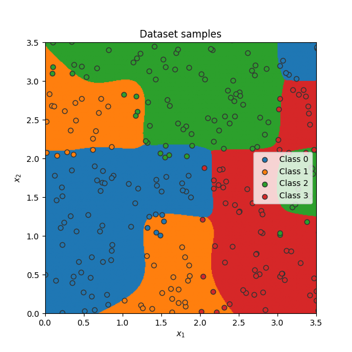

# Multilevel Classification Project

This is a personal research project gain experience in using PyTorch and applying it to the implementation of a multilevel classification system with multiple hidden layers. The model is designed to classify data across different hierarchical levels.

## Architecture

The diagram above illustrates the network structure with two hidden layers using tanh activation functions, processing inputs through layers of sizes 12 and 8 before final classification.

## Overview

The multilevel classification model enables:
- Hierarchical classification across multiple categorical levels
- Deep learning-based feature extraction
- Flexible architecture for various input/output configurations